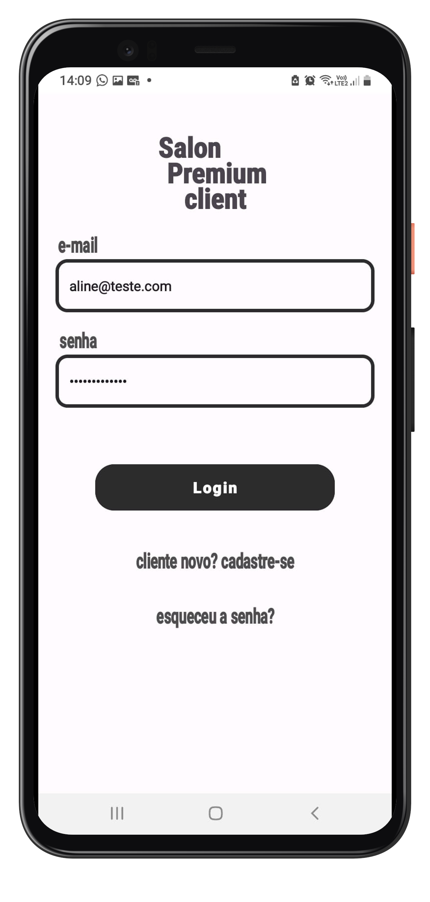
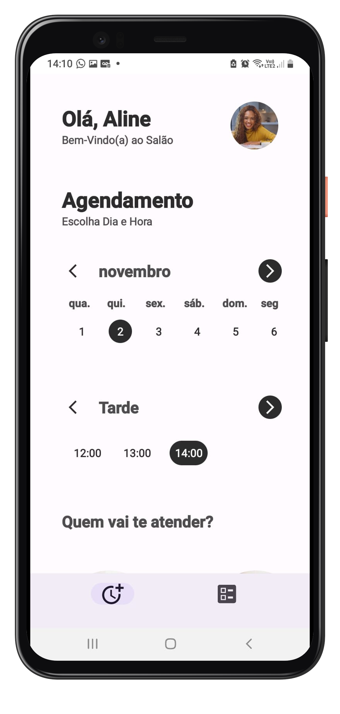
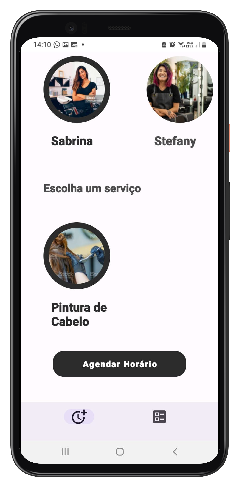
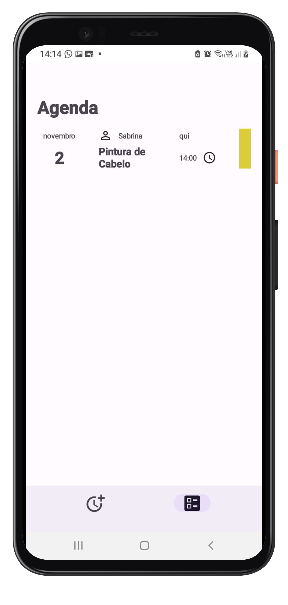
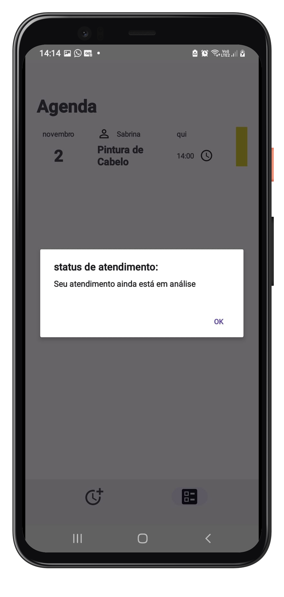

<h1 align="center">Salon Premium Client</h1>

  
  
   
  
  
  

  

⭐ Esse é um projeto para demonstrar minha capacidade no desenvolvimento Android nativo com Kotlin. Mais informações técnicas abaixo.

✂️ Salon Premium Client é um aplicativo para android que possibilita que clientes de um salão vejam os serviços, funcionários e horários disponíveis e marquem atendimentos em um salão de beleza.

 

## Download do App

Faça o download do <a href="apk/app-debug.apk?raw=true">APK diretamente</a>. Você pode ver <a href="https://www.google.com/search?q=como+instalar+um+apk+no+android">aqui</a> como instalar um APK no seu aparelho android!
